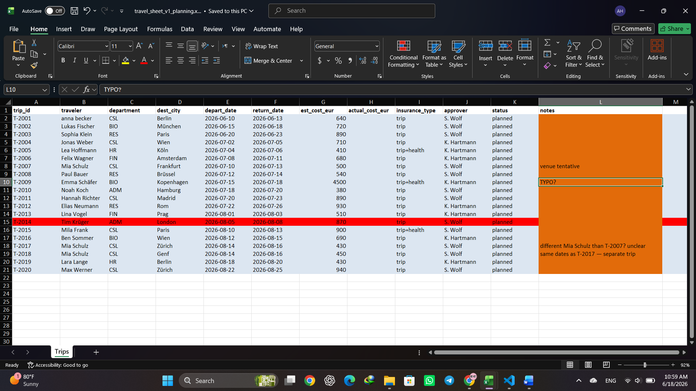
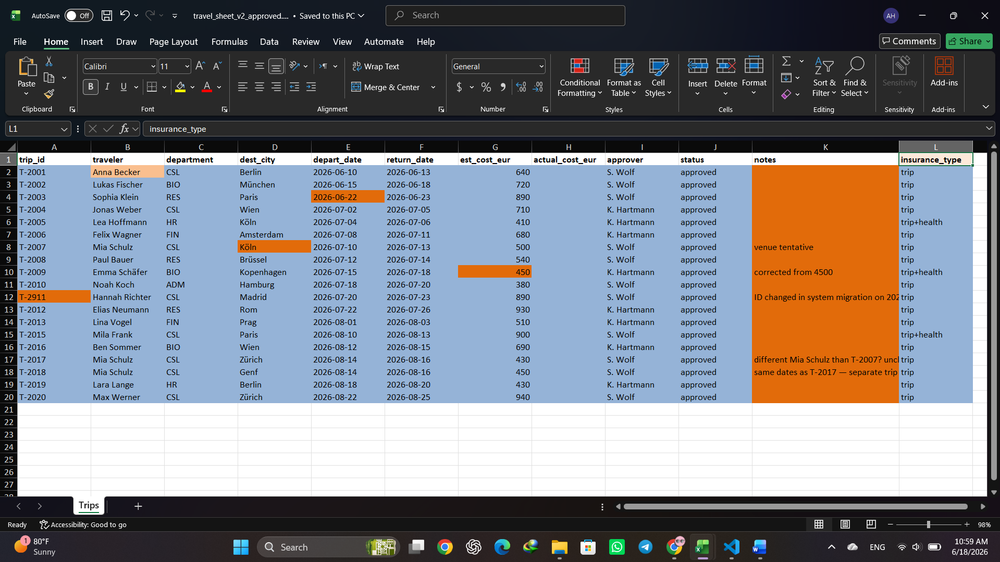
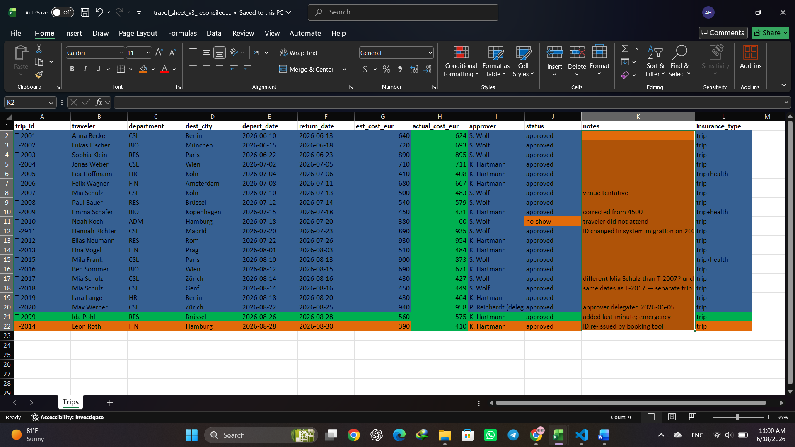

# Data Inspection Notes

During the comparison of the three spreadsheet snapshots, I manually reviewed the records and noted the following observations:

## General observations

- Most trips remain consistent across all three snapshots and only a relatively small subset contains meaningful changes.
- Several differences are administrative updates rather than entirely new records.
- Some changes affect workflow decisions directly (status changes, cost corrections, added or removed trips), while others appear to be cosmetic or low-priority updates.
- The comparison highlighted the importance of separating meaningful changes from noise to avoid overwhelming the user.

## Specific findings

### T-2001 – Name capitalization

- Traveller name changes from **"anna becker"** in v1 to **"Anna Becker"** in later snapshots.
- This appears to be a formatting correction rather than a business-relevant change.
- I classified this as low-priority noise.

### T-2009 – Cost correction

- Estimated cost changes from **€4,500** in v1 to **€450** in later snapshots.
- The notes explicitly mention that the value was corrected.
- This is a high-impact change because it could influence approvals, budgeting, and reporting.

### T-2011 → T-2911 – Trip ID migration

- The trip appears to continue across snapshots, but the identifier changes from **T-2011** to **T-2911**.
- Notes indicate a system migration.
- This appears to be a record rename rather than a deletion and re-creation.

### T-2010 – Status change

- Status changes from planned/approved workflow states to **"no-show"** in the reconciled snapshot.
- Notes indicate that the traveller did not attend the trip.
- This is a meaningful workflow outcome and should be highlighted prominently.

### T-2014 – Ambiguous ID reuse

- In v1, **T-2014** belongs to Tim Krüger and is later removed.
- In v3, **T-2014** appears again but is associated with Leon Roth.
- Notes suggest that the ID may have been re-issued by the booking tool.
- This was the most ambiguous case in the dataset and became the primary edge case considered during the design process.

### T-2017 and T-2018 – Potential duplicate appearance

- Both records belong to Mia Schulz and share very similar dates.
- Notes indicate that they are likely separate trips despite appearing related.
- The records should remain separate but may benefit from additional visual context.

### T-2020 – Approver delegation

- The trip remains unchanged except for the approver field.
- Approval responsibility is delegated to another person in the final snapshot.
- This is a meaningful administrative change but lower priority than status or identity changes.

### T-2099 – Late addition

- The trip appears only in the reconciled snapshot.
- Notes describe it as an emergency addition.
- This represents a true newly added record and should be surfaced clearly.

## Observations that influenced the design

- Unchanged records should not receive the same visual emphasis as changed records.
- Minor formatting updates and similar cosmetic changes should be treated as noise.
- Structural changes such as row ordering or column reordering should not be interpreted as meaningful record changes.
- Users should be able to focus quickly on additions, removals, status changes, identifier migrations, and large value corrections.
- Ambiguous cases should be surfaced for review rather than automatically classified.

### Notes column importance

One unexpected finding was the importance of the **notes** column, especially in v3. Several key changes (ID migration, cost correction, emergency additions, approver delegation, and potential ID reuse) could only be fully understood through the contextual information recorded in the notes.
In several cases, the notes provided more useful information than the changed values themselves and were essential for understanding the business context behind the modification.

## Screenshots

### Screenshot 1 – Initial planning snapshot highlighting key observations

### Screenshot 2 – Approved snapshot showing corrections and ID migration

### Screenshot 3 – Reconciled snapshot showing final outcomes and late additions

